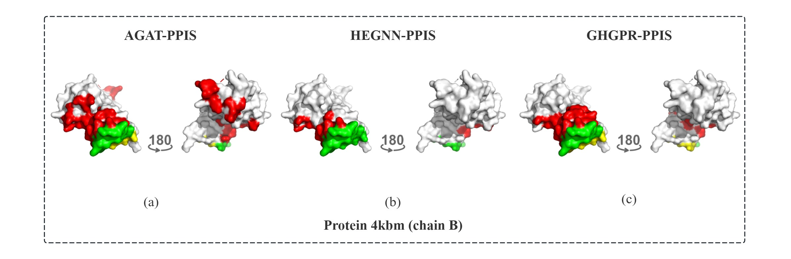

<h1 align="center">
High-Order Equivariant Graph Neural Networks with Geometric Awareness for Protein–Protein Interaction Site Prediction
</h1>
<p align="center">


</p>

<p align="justify">
Accurate identification of protein-protein interaction sites (PPIS) is crucial for understanding biological mechanisms. Recently, graph neural network based PPIS prediction methods have made certain progress. However, a key issue remains: both explicit low-order interactions and implicit high-order interactions of protein residues play a positive role in the site identification. Most existing methods rely on protein pairwise graph, which struggle to effectively capture high-order interactions when the protein graph local structure is sparse. To address this limitation, we propose a novel algorithm, HEGNN-PPIS. By introducing hypernodes and hyperedges, HEGNN-PPIS transcends the inherent constraints of pairwise graph representations, enabling efficient learning of high-order interaction patterns. To evaluate its capacity for high-order information modeling, we construct sparse test sets by selecting proteins with sparse local neighborhoods from standard benchmark datasets. On this challenging subsets, HEGNN-PPIS substantially outperforms current state-of-the-art methods, achieving absolute gains of 5.5% to 10.4% in AUPRC. Moreover, on the full benchmark datasets, HEGNN-PPIS attains state-of-the-art (SOTA) performance overall. Notably, benefiting from the rich high-order contextual information encoded by hypernodes and hyperedges, HEGNN-PPIS delivers strong predictive performance even with a shallow network architecture, highlighting its efficiency and modeling power. 
</p>

<p align="center">
 <br>
<b>Figure 1.</b> The overall architecture of HEGNN-PPIS
</p>


## Conda Environment Setup

``` shell
conda create --name hegnn --file ./src/requirements.txt
conda activate hegnn
```

## Datasets

<p align="justify">
In this study, we conduct experiments using the protein-protein datasets provided by the previous work AGAT-PPIS. The AGAT-PPIS datasets consist of a training set (Train_335-1) and four test sets (Test_60, Test_315-28, Btest_31-6 and UBtest_31-6). Detailed information about these datasets are provided in Table 1. Throughout our work, Train_335-1 and Test_60 are used as the primary datasets for model training and testing, while the remaining three test sets are mainly employed to evaluate the model’s generalization ability.
</p>

### Load Dataset

```python

```


## Train


```commandline
python train.py
```

## test


```commandline
python test.py
```

Output

```commandline
Test_60_best.pkl
========== Evaluate Test set ==========
Test loss:  0.3313633605837822
Test binary acc:  0.8904443091905052
Test precision: 0.6542010684798446
Test recall:  0.6491566265060241
Test f1:  0.6516690856313498
Test AUC:  0.9031634424589678
Test AUPRC:  0.6948013397793492
Test mcc:  0.5866768793461459
Threshold:  0.25

Test_315-28_best.pkl
========== Evaluate Test set ==========
Test loss:  0.30311310639157113
Test binary acc:  0.8846395918908175
Test precision: 0.5821278342053965
Test recall:  0.6623861779126781
Test f1:  0.6196690875334462
Test AUC:  0.9033724920204723
Test AUPRC:  0.6531124034708858
Test mcc:  0.5536100201290782
Threshold:  0.4

BTest_31-6_best.pkl
========== Evaluate Test set ==========
Test loss:  0.26363127171993256
Test binary acc:  0.9002387448840382
Test precision: 0.5901639344262295
Test recall:  0.6820027063599459
Test f1:  0.632768361581921
Test AUC:  0.9201093105383017
Test AUPRC:  0.6588535502237624
Test mcc:  0.5774103605926706
Threshold:  0.26

UBtest_31-6_best.pkl
========== Evaluate Test set ==========
Test loss:  0.4149226629734039
Test binary acc:  0.8707115092107487
Test precision: 0.4637096774193548
Test recall:  0.48523206751054854
Test f1:  0.4742268041237113
Test AUC:  0.8252349204342279
Test AUPRC:  0.39961346129565745
Test mcc:  0.4006974913649132
Threshold:  0.21
```

Visualization
---

---

