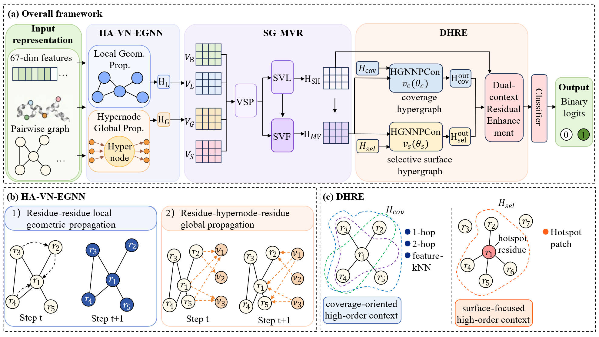

<h1 align="center">HEGNN-PPIS</h1>

<p align="center">
  <strong>High-order equivariant graph neural networks for protein-protein interaction site prediction</strong>
</p>

<p align="center">
  
  
  
  
  
  
  
</p>

HEGNN-PPIS is a residue-level protein-protein interaction site predictor based
on a dual-branch hypergraph architecture. The complete-hypergraph branch
preserves global structural context, while the selective surface-hypergraph
branch captures interface-enriched local patterns. Their independently learned
representations are fused for residue classification.

The repository includes the source code, Train335 and Test60 benchmark inputs,
three archived checkpoints, residue-level predictions, reproducibility
scripts, and report-ready ablation data.

<p align="center">
  
  <br />
  <b>Figure 1.</b> Overall architecture of HEGNN-PPIS.
</p>

## Test60 results

The reported ensemble uses seeds `2181`, `2182`, and `2183`, continuation epoch
`3`, and a validation-selected blend weight of `0.25`.

| Metric | Value |
|:--|--:|
| ACC | 0.898433 |
| Precision | 0.685557 |
| Recall | 0.658795 |
| F1 | 0.671910 |
| MCC | 0.612024 |
| AUROC | **0.925141** |
| AUPRC | **0.740268** |

Epoch and blend-weight selection used the fixed Train335 validation split.
Test60 was evaluated once, and binary decisions use the frozen
validation-selected prediction rule.

## Quick start

The verified environment used Python 3.12, PyTorch 2.11.0, CUDA 12.8, DHG
0.9.5, and PyTorch Geometric 2.7.0.

```powershell
conda create -n hegnn-ppis python=3.12
conda activate hegnn-ppis
pip install torch torchvision torchaudio --index-url https://download.pytorch.org/whl/cu128
pip install -r requirements.txt
```

Install the PyTorch build matching your local CUDA version when CUDA 12.8 is
not available. CPU execution is supported, but full inference is slower.

### Verify the committed results

This command recomputes every metric from the committed residue-level
predictions and verifies the checkpoint and artifact SHA-256 hashes. A GPU is
not required.

```powershell
python scripts/verify_results.py
```

Expected output:

```text
Result verification passed: ACC=0.898432745, Precision=0.685556670, AUROC=0.925140896, AUPRC=0.740267747
```

### Run the smoke test

```powershell
python tests/smoke_test.py
```

## Reproduce Test60 inference

All Train335 validation and Test60 inputs required by the archived evaluation
are included.

```powershell
python src/evaluate.py
python scripts/verify_results.py --result-dir output/test60
```

PowerShell users can run both commands through:

```powershell
.\scripts\reproduce_test60.ps1
```

New predictions are written to `output/test60/`. The committed reference files
under `results/test60/` are never overwritten.

## Train from scratch

Run the following command from the repository root:

```powershell
python src/train.py `
  --seeds 2020 2021 2022 `
  --epochs 30 `
  --output_dir output/train
```

The default arguments use the included Train335 and Test60 inputs.

## Generate selective surface hypergraphs

```powershell
python src/generate_surface_hypergraph.py --help
```

The utility supports the surface-selection strategies and output settings used
by the selective hypergraph branch.

## Repository structure

```text
HEGNN-PPIS/
|-- src/
|   |-- Dataset/              Train335 and benchmark datasets
|   |-- Feature/              Residue-level input features
|   |-- Graph/                Pairwise graphs and hypergraphs
|   |-- model.py              Dual-branch model
|   |-- model_ablation.py     Component-ablation wrapper
|   |-- train.py              Training entry point
|   `-- evaluate.py           Three-seed Test60 evaluation
|-- checkpoints/              Three epoch-3 model state dictionaries
|-- scripts/                  Reproduction and verification helpers
|-- tests/                    Fast model-construction smoke test
|-- requirements.txt
`-- README.md
```

## Result artifacts

| File | Description |
|:--|:--|
| [`metrics.csv`](results/test60/metrics.csv) | Aggregate metrics and confusion matrix |
| [`seed_metrics.csv`](results/test60/seed_metrics.csv) | Metrics for the three ensemble members |
| [`predictions.csv`](results/test60/predictions.csv) | Residue-level probabilities and decisions |
| [`experiment.json`](results/test60/experiment.json) | Protocol, configuration, checkpoint hashes, and split audit |
| [`checksums.sha256`](results/test60/checksums.sha256) | SHA-256 manifest for checkpoints and result artifacts |
| [`core_component_ablation.csv`](results/ablation/core_component_ablation.csv) | Numeric component-ablation statistics |
| [`manuscript_table.csv`](results/ablation/manuscript_table.csv) | Rounded report-ready ablation values |

The ablation table reports a separate three-seed, 30-epoch experiment. Its rows
should not be combined directly with the final checkpoint ensemble because the
two tables use different evaluation pipelines.

## License

This project is distributed under the
[BSD 2-Clause License](LICENSE).
