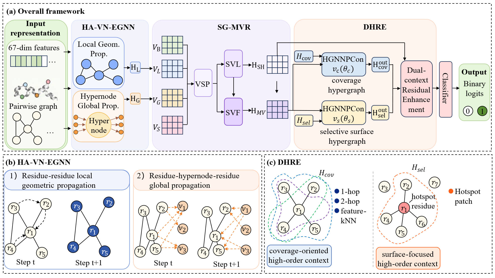

<h1 align="center">HEGNN-PPIS</h1>

<p align="center">
  <strong>High-order equivariant graph neural networks for protein-protein interaction site prediction</strong>
</p>

<p align="center">
  
  
  
  
  
</p>

HEGNN-PPIS is a residue-level protein-protein interaction site predictor based on a dual-branch hypergraph architecture. The complete-hypergraph branch preserves global structural context, while the selective surface-hypergraph branch captures interface-enriched local patterns. Their representations are fused for residue classification.

The repository includes source code, Train335 and benchmark datasets, precomputed residue features and graphs, and pretrained weights.

<p align="center">
  
  <br />
  <b>Figure 1.</b> Overall architecture of HEGNN-PPIS.
</p>

## Test60 results

The reported ensemble uses seeds `2181`, `2182`, and `2183`, continuation epoch `3`, and a validation-selected blend weight of `0.25`.

| Metric | Value |
|:--|--:|
| ACC | 0.898433 |
| Precision | 0.685557 |
| Recall | 0.658795 |
| F1 | 0.671910 |
| MCC | 0.612024 |
| AUROC | 0.925141 |
| AUPRC | 0.740268 |

Epoch and blend-weight selection used the fixed Train335 validation split. Test60 was evaluated once, and binary decisions use the frozen validation-selected prediction rule.

## Quick start

The project uses Python 3.12, PyTorch 2.11.0, CUDA 12.8, DHG 0.9.5, and PyTorch Geometric 2.7.0. Choose the PyTorch build for your CUDA version.

```powershell
conda create -n hegnn-ppis python=3.12
conda activate hegnn-ppis
pip install torch torchvision torchaudio --index-url https://download.pytorch.org/whl/cu128
pip install -r requirements.txt
```

## Training

Training uses Train335 with the sequence-homology split in [`protocol/homology_i30c80.json`](protocol/homology_i30c80.json). Run from the repository root:

```powershell
python src/train_validation_only.py --alpha-full 0.05 --alpha-selective 0.10 --seed 2021 --epochs 30 --output-dir output/run_seed2021
```

## Testing

Use the pretrained weights to generate residue-level predictions for the benchmark datasets:

```powershell
python pretrained/predict.py btest
python pretrained/predict.py test315
python pretrained/predict.py ubtest
python pretrained/predict.py test60_ensemble
```

The CSV files are written to `output/pretrained/`.

## Repository structure

```text
HEGNN-PPIS/
|-- src/                    Models, training code, datasets, features, and graphs
|-- protocol/               Homology split manifest
|-- pretrained/            Weights and prediction entry point
|-- requirements.txt
`-- README.md
```

## License

This project is distributed under the [BSD 2-Clause License](LICENSE).
